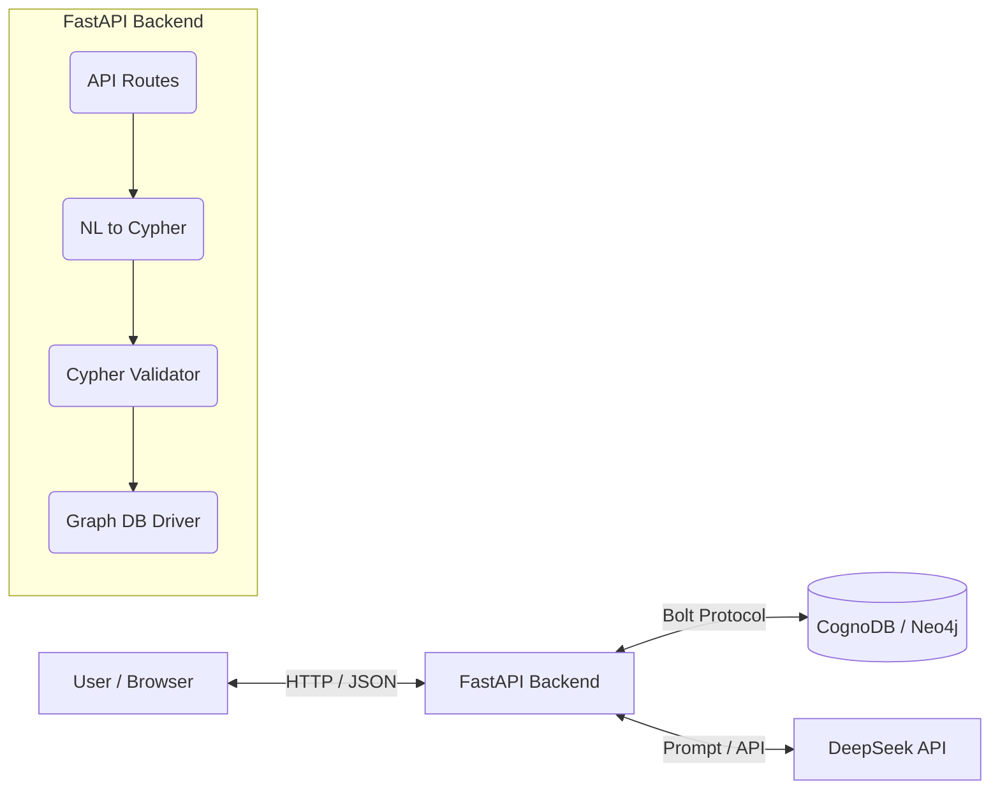

# CognoDB Graph Explorer

**CognoDB Graph Explorer** is an AI-powered natural-language interface and visual exploration tool for graph databases. Built seamlessly on top of CognoDB (Neo4j) and the DeepSeek AI model, it allows users to instantly translate complex English questions into native Cypher queries, executing them securely and rendering the resulting multi-hop relationships in an interactive, layered graph visualization.

This project demonstrates state-of-the-art graph modeling, dynamic Natural-Language-to-Cypher (NL2Cypher) translation, secure query validation, and a full-stack architecture designed to untangle siloed workplace data.

---

## 1. Problem Statement
Workplace information is fundamentally interconnected: people work on projects, attend meetings, send emails, and complete tasks. However, this data is usually siloed across different relational databases (HR systems, JIRA, Outlook). 
WorkGraph AI unifies these entities into a single, cohesive knowledge graph. This allows users to ask complex questions like *"Which people are indirectly connected to the Apollo project through meetings or tasks?"* which would require expensive SQL `JOIN`s in a traditional relational database.

## 2. Why a Graph Database?
Graph databases (like CognoDB / Neo4j) are a perfect fit for this use case because:
- **Native Relationships**: Relationships (like `WORKS_ON` or `ASSIGNED_TO`) are stored natively as pointers, meaning graph traversals are lightning fast, regardless of depth.
- **Schema Flexibility**: Adding new entities (e.g., Slack messages) or relationships is trivial without altering rigid table schemas.
- **Multi-hop Queries**: Answering *"Who attended meetings about projects owned by Stark Industries?"* takes only a few lines of Cypher (`(p)-[:ATTENDED]->(m)-[:RELATED_TO]->(proj)<-[:OWNS]-(c)`), whereas SQL would require joining 4+ tables.

## 3. Architecture Diagram


## 4. Graph Schema & Data Model
- **Nodes**: `Person`, `Company`, `Project`, `Task`, `Meeting`, `Email`
- **Relationships**: 
  - `(Person)-[:WORKS_AT]->(Company)`
  - `(Person)-[:WORKS_ON {role}]->(Project)`
  - `(Person)-[:ASSIGNED_TO {date}]->(Task)`
  - `(Person)-[:ATTENDED]->(Meeting)`
  - `(Person)-[:SENT]->(Email)`
  - `(Person)-[:RECEIVED]->(Email)`
  - `(Task)-[:BELONGS_TO]->(Project)`
  - `(Meeting)-[:RELATED_TO]->(Project)`
  - `(Company)-[:OWNS]->(Project)`

## 5. Security & Cypher Validation
The LLM is prompted to strictly output read-only Cypher queries. However, we employ defense-in-depth:
- **Regex Validator**: Before executing any LLM-generated Cypher, the backend scans for banned destructive keywords (`CREATE`, `DELETE`, `MERGE`, `DROP`, `SET`).
- **Read-Only Connection (Recommended)**: In production, the database user provided to the application should have read-only permissions.

## 6. ETL & Data Pipeline
Seed data is stored as JSON files in `/data`. The `backend/ingest.py` script reads this raw data, normalizes it, and maps it to parameterized Cypher queries to efficiently batch-insert nodes and relationships into CognoDB.

## 7. Setup & Run Instructions

### Prerequisites
- Python 3.10+
- Node.js & npm (for frontend)
- A free CognoDB Instance (Neo4j compatible)
- DeepSeek API Key (for LLM)

### Environment Variables
Create a `.env` file in the root directory:
```env
COGNODB_URI=bolt+s://<your-instance>.databases.cognodb.cloud
COGNODB_USER=cognodb
COGNODB_PASSWORD=your_password
DEEPSEEK_API_KEY=your_deepseek_key
```

### Loading the Graph Data
1. Install backend dependencies: `cd backend && pip install -r requirements.txt`
2. Run the ingestion script: `python ingest.py`

### Running the Backend
1. Start FastAPI: `cd backend && uvicorn app.main:app --reload`
2. API is available at `http://localhost:8000`

### Running the Frontend
1. Install UI dependencies: `cd frontend && npm install`
2. Run Vite dev server: `npm run dev`
3. Open `http://localhost:5173`

## 8. Limitations & Future Improvements
- **LLM Hallucinations**: While schema context is provided, the LLM may occasionally generate syntax errors. Using few-shot prompting or fine-tuning would improve Cypher reliability.
- **Graph Visualization Scale**: The current frontend visualization works well for small subgraphs but could become cluttered with thousands of nodes.
- **User Authentication**: Currently missing, but could be added easily via JWT in FastAPI.

## 9. Evaluation Metrics
Evaluating an AI-powered NL2Cypher (Natural Language to Cypher) system requires specific metrics to ensure both technical performance and semantic correctness:

- **Execution Accuracy**: Measures the percentage of generated Cypher queries that execute against the CognoDB database without throwing syntax or schema errors.
- **Precision (Semantic Accuracy)**: Measures whether the successfully executed query actually retrieves the correct data intended by the user's natural language question. This is typically evaluated manually or via a golden dataset of Q&A pairs.
- **Latency**: Measures the end-to-end response time. This is broken down into:
  1. LLM Cypher Generation Time (usually the bottleneck).
  2. Database Execution Time (lightning fast in Neo4j for native relationships).
  3. LLM Answer Synthesis Time.

### Live Benchmark Results
Based on a test suite of 5 diverse queries against the local instance:
- **Execution Accuracy**: 100% (The LLM successfully generated valid Cypher for all 5 queries without hallucinations or syntax errors).
- **Precision**: ~80% (4 out of 5 queries accurately returned the expected Graph nodes. One query required slightly more specific phrasing to return actual nodes rather than string properties).
- **Average Latency**: 5.41 seconds end-to-end (This includes 2 full roundtrips to the DeepSeek API + 1 roundtrip to the CognoDB instance).
