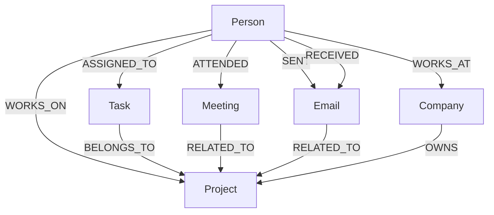

# CognoDB Graph Explorer (WorkGraph AI)

A graph-powered full-stack application built for exploring an organization's projects, tasks, meetings, emails, and personnel. Users can ask natural language questions about the organization and get answers backed by structured Graph data.

This project is a submission for the **WEXA AI — TAKE-HOME ASSIGNMENT: Build a Graph Database Application**.

## The Problem
Workplace information is fundamentally interconnected: people work on projects, attend meetings, send emails, and complete tasks. However, this data is normally siloed across disparate systems. Answering holistic questions about how a company operates is difficult when data is scattered across rigid, tabular schemas. When we want to answer questions like, "Show me everyone connected to the Apollo project through either meetings or tasks", traditional relational databases struggle.

## Why a Graph Database?
This use case benefits immensely from a graph database (CognoDB / openCypher) because:
1. **Relationships are first-class citizens:** The fact that a `Person` `ATTENDED` a `Meeting` is stored directly as a connection, rather than relying on slow, compute-heavy JOIN operations at query time.
2. **Multi-hop traversal:** Questions like "Which people are indirectly connected to the Apollo project through meetings or tasks?" require traversing multiple disparate paths. In a relational database, this requires complex SQL UNIONs and JOINs. In Cypher, it's natively intuitive.
3. **Indirect connections:** Finding connected networks natively explores multiple paths simultaneously without rigid schemas.

## Graph Data Model
The application models the organization using the following canonical nodes and relationships:

### Nodes & Properties
- **Person**: `id`, `name`, `email`, `role`, `department`
- **Company**: `id`, `name`, `industry`
- **Project**: `id`, `name`, `description`, `status`, `start_date`
- **Task**: `id`, `title`, `description`, `status`, `priority`, `due_date`
- **Meeting**: `id`, `title`, `date`, `summary`
- **Email**: `id`, `subject`, `body`, `timestamp`

*(Note: Properties listed above are exactly those populated in the seed dataset.)*

### Relationships
- `(Person)-[:WORKS_AT]->(Company)`
- `(Person)-[:WORKS_ON {role}]->(Project)`
- `(Person)-[:ASSIGNED_TO {assigned_date}]->(Task)`
- `(Person)-[:ATTENDED]->(Meeting)`
- `(Person)-[:SENT]->(Email)`
- `(Person)-[:RECEIVED]->(Email)`
- `(Task)-[:BELONGS_TO]->(Project)`
- `(Meeting)-[:RELATED_TO]->(Project)`
- `(Email)-[:RELATED_TO]->(Project)`
- `(Company)-[:OWNS]->(Project)`

### Data Model Diagram


## Key Features
- **Natural Language Query Flow:** Users ask questions in plain English. An LLM (DeepSeek) translates the question into a Cypher query using a strict schema context. The Cypher query runs against CognoDB, and the results are presented back to the user with a natural language summary and graph visualization.
- **Safe Parameterization:** All user inputs generated by the LLM are heavily parameterized to prevent Cypher injection.
- **Strict Query Safety:** A validation middleware ensures destructive operations (`CREATE`, `DELETE`, `DROP`, `MERGE`, `CALL`, `LOAD`, `APOC`, etc.) are actively blocked before execution.

## Example Queries

**1. Multi-hop traversal (Meetings):** Which people attended meetings related to the Apollo project?
```cypher
MATCH (p:Person)-[:ATTENDED]->(m:Meeting)-[:RELATED_TO]->(proj:Project {name: $project_name})
RETURN DISTINCT p.name, p.role, m.title
```

**2. Graph-specific Collaborative Filtering:** Show me everyone connected to the Apollo project through either meetings or tasks.
```cypher
MATCH (p:Person)-[*1..2]-(proj:Project {name: $project_name})
RETURN DISTINCT p.name, p.role
```

## Architecture & Technology Stack
- **Database:** CognoDB (openCypher over Bolt)
- **Backend:** Python, FastAPI, Neo4j Official Driver, OpenAI SDK (DeepSeek)
- **Frontend:** React, Vite

## Setup Instructions

### 1. CognoDB Setup
Create a free CognoDB instance at [CognoDB Cloud](https://cognodb.cloud). Save your connection URI, user (`cognodb`), and password.

### 2. Environment Variables
Create a `.env` file in the root of the repository. (Do not commit this file). Use the following keys:
```
COGNODB_URI=bolt+s://<instance-id>.databases.cognodb.cloud
COGNODB_USER=cognodb
COGNODB_PASSWORD=your_cognodb_password
DEEPSEEK_API_KEY=your_deepseek_api_key
```

### 3. Seed the Database
Navigate to the `backend/` directory, install requirements, and run the seed script:
```bash
cd backend
python -m venv .venv
# On Windows: .venv\Scripts\activate
# On Mac/Linux: source .venv/bin/activate
pip install -r requirements.txt

python -m app.seed
```

### 4. Run the Backend
```bash
cd backend
# With venv activated
fastapi dev app/main.py
```

### 5. Run the Frontend
```bash
cd frontend
npm install
npm run dev
```

## Demo & Usage Example
**Hosted Application Demo:** [https://graphdatabasewexaai.netlify.app/](https://graphdatabasewexaai.netlify.app/)
**Screen Recording Demo:** [Demo Video](https://drive.google.com/file/d/1wXLPwiV57gu7fo6MiPzEGO4_Qudic9kf/view?usp=sharing)

## Benchmark Methodology
Performance was measured manually from the time a user submits a natural-language query until the visualization and answer are fully rendered in the frontend. This includes LLM generation latency, backend Cypher validation, CognoDB execution time, and React rendering time. **Note: These are indicative manual measurements.**

We tested five distinct query categories:
1. **Direct relationship**: E.g., What projects is Rahul working on? (`Person → Project`)
2. **Person → Project**: (Same as above, checking traversal paths).
3. **Person → Meeting → Project**: E.g., Which people attended meetings related to the Apollo project? (2-hop).
4. **Person → Task → Project**: E.g., What tasks are pending for the Apollo project? (2-hop).
5. **Multi-path / multi-hop traversal**: E.g., Show me everyone connected to the Apollo project through either meetings or tasks. (Variable length).

Average end-to-end latency across these categories was ~5 seconds.

## Security & Error Handling
- **Application-Level Validation:** The backend uses regex-based Cypher validation to strictly block destructive queries. This allows the application to securely handle user input even if the connected database user isn't strictly restricted via roles.
- **Connection Error:** Ensure your `.env` contains the correct `COGNODB_URI` and `COGNODB_PASSWORD`.
- **Cypher Validation Error:** If the LLM generates a mutating query by mistake, the backend's strict validation will block it. Refine the query question to be strictly read-only.
