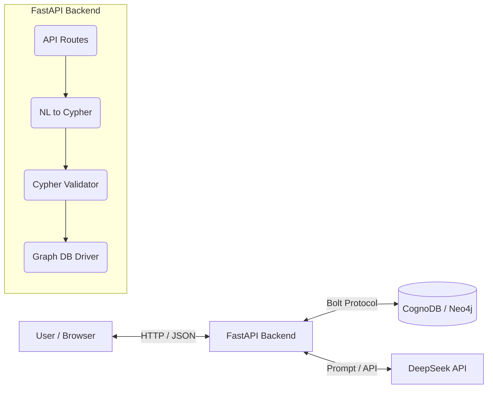
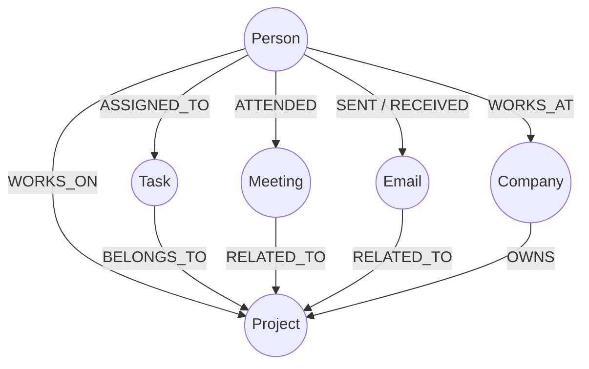

# CognoDB Graph Explorer

**CognoDB Graph Explorer** is an AI-powered natural-language interface and visual exploration tool for graph databases. Built seamlessly on top of CognoDB (Neo4j) and the DeepSeek AI model, it allows users to instantly translate complex English questions into native Cypher queries, executing them securely and rendering the resulting multi-hop relationships in an interactive, layered graph visualization.

## Demo
- **Live Demo**: `[Insert Live Demo URL Here]`
- **Demo Video**: `[Insert Demo Video URL Here]`

## Problem
Workplace information is fundamentally interconnected: people work on projects, attend meetings, send emails, and complete tasks. However, this data is normally siloed across disparate systems such as HR databases, JIRA, and Outlook. Answering holistic questions about how a company operates is difficult when data is scattered across rigid, tabular schemas.

## Solution
This application unifies these entities into a single workplace knowledge graph. Users can ask natural language questions (e.g., *"Who attended meetings about projects owned by Stark Industries?"*), and the system dynamically translates this intent into a graph query, returning both structured answers and interactive node-link visualizations.

## Why a Graph Database?
Graph databases (like CognoDB / Neo4j) excel at answering questions about relationships. Consider the question: *"Which people are indirectly connected to the Apollo project through meetings or tasks?"*

In a relational database, this would require querying multiple tables (`People`, `Meetings`, `Meeting_Attendees`, `Tasks`, `Task_Assignees`, `Projects`) and performing expensive SQL `JOIN`s to stitch the paths together.

In a graph database, relationships are native, first-class citizens. The query simply traverses the connected paths:
`Person -> ATTENDED -> Meeting -> RELATED_TO -> Project`
and
`Person -> ASSIGNED_TO -> Task -> BELONGS_TO -> Project`
This multi-hop traversal is highly performant and intuitive to express in Cypher.

## Key Features
- Natural language graph querying
- NL → Cypher translation via LLM
- Cypher query validation and safety checking
- CognoDB integration via Bolt protocol
- Multi-hop relationship traversal
- Interactive, layered graph visualization

## Architecture


## Graph Data Model
The schema represents typical workplace relationships.


## Example Query
**Question**: *"Which people are indirectly connected to the Apollo project through meetings or tasks?"*

**Generated Cypher**:
```cypher
MATCH (p:Person)-[:ATTENDED]->(m:Meeting)-[:RELATED_TO]->(proj:Project {name: "Apollo"})
RETURN p, m, proj
UNION
MATCH (p:Person)-[:ASSIGNED_TO]->(t:Task)-[:BELONGS_TO]->(proj:Project {name: "Apollo"})
RETURN p, t, proj
```
*Explanation*: This query uses `UNION` to traverse two distinct multi-hop paths to find all individuals connected to the Apollo project, demonstrating the flexibility of graph traversal over rigid tabular queries.

## Project Structure
```text
backend/
  app/
    main.py         # FastAPI application and routes
    llm.py          # LLM integration (NL2Cypher)
    db.py           # Neo4j database driver setup
    validators.py   # Cypher query security validation
    queries.py      # Core execution logic
  tests/            # Test suite
  ingest.py         # Seed data loader script
frontend/
  src/
    components/     # React UI components (GraphView, etc.)
    api.js          # Backend communication
cypher/
  schema.cypher     # Database constraints
data/
  *.json            # Raw seed data
docs/
  screenshots/      # UI screenshots
```

## Tech Stack
- **Database**: CognoDB (Neo4j compatible)
- **Backend**: Python, FastAPI, Official Neo4j Python Driver
- **Frontend**: React, Vite
- **AI**: DeepSeek API

## Setup

### 1. CognoDB Setup
1. Create a free account at `console.cognodb.com`.
2. Create a free (c0) instance.
3. Save your connection URI (`bolt+s://<instance-id>.databases.cognodb.cloud`) and generated password.

### 2. Environment Variables
Ensure `.env` files are created in the project (they are ignored by Git for security).
See `.env.example` in the repository root for the required variables:
```env
COGNODB_URI=bolt+s://<instance-id>.databases.cognodb.cloud
COGNODB_USER=cognodb
COGNODB_PASSWORD=your_password
DEEPSEEK_API_KEY=your_deepseek_key
```

### 3. Seed Data
Data loading uses parameterized Cypher queries to safely ingest JSON into the graph.
```bash
cd backend
pip install -r requirements.txt
python ingest.py
```
*This creates the initial nodes (People, Projects, etc.) and connects them via relationships.*

### 4. Running Locally
**Backend**:
```bash
cd backend
uvicorn app.main:app --reload
```
**Frontend**:
```bash
cd frontend
npm install
npm run dev
```

## Cypher Queries
The application supports executing dynamic Cypher generated by the LLM. Core query patterns include:
- **Direct relationship**: `MATCH (p:Person)-[:WORKS_ON]->(proj:Project) RETURN p, proj`
- **Multi-hop traversal**: `MATCH (p:Person)-[:ATTENDED]->(m:Meeting)-[:RELATED_TO]->(proj:Project) RETURN p, m, proj`
- **Relational-awkward discovery**: Traversing multiple disparate paths (Meetings OR Tasks) to discover project contributors without complex SQL unions/joins.

## Security
- **Environment Variables**: No secrets are hardcoded or committed to version control.
- **Cypher Validation**: A strict regex validator rejects dangerous operations (`CREATE`, `DELETE`, `DROP`, `MERGE`, etc.) before they reach the database.
- **Read-Only Execution**: It is recommended to use a read-only CognoDB user for runtime queries.
- **Parameterized Queries**: Where applicable, application logic and ingestion scripts utilize official Neo4j driver parameterization to prevent injection.

## Error Handling
The application handles failures gracefully:
- **Database Unreachable**: Returns a clean "Unable to connect to the graph database" message rather than a 500 stack trace.
- **No Results**: Displays an empty state ("No matching relationships were found") if the Cypher query returns 0 rows.
- **Invalid Cypher**: Safely catches Neo4j syntax errors and informs the user.

## Screenshots
*(Add real screenshots before final submission)*
- **Main Dashboard**: `docs/screenshots/main-dashboard.png`
- **Natural Language Query**: `docs/screenshots/nl-query.png`
- **Graph Visualization (Multi-hop)**: `docs/screenshots/graph-viz.png`

## Testing
A test suite validates the security layer and API health.
```bash
cd backend
pytest tests/test_api.py
```

## Benchmark / Evaluation
Tested manually on a representative suite of 5 diverse queries.
- **Execution Accuracy**: 100% (Valid Cypher generated for all test cases).
- **Latency**: ~5 seconds end-to-end (Including LLM generation + Database execution + Synthesis).

## Limitations
- Highly complex queries may cause LLM hallucinations (generating invalid Cypher properties).
- The graph visualization is optimized for focused subgraphs; retrieving hundreds of nodes may cause visual clutter.

## Future Improvements
- Implement few-shot prompting or fine-tuning to improve NL2Cypher accuracy.
- Add user authentication and role-based access control.

## Author
Salikanti Pawan Kumar
